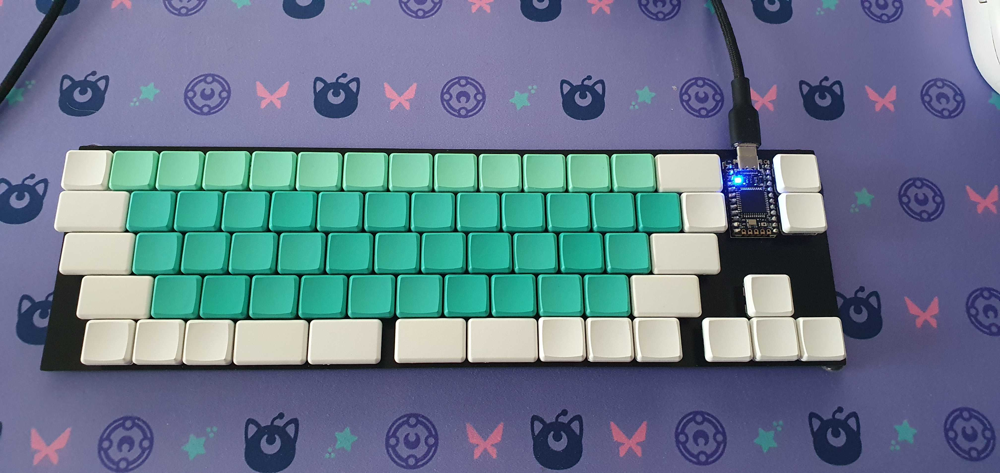

# choc69

69 key fc660-ish layout with choc switches and no stabilizers.

it has been prototyped with jlcpcb, things seem to work.

firmware can be found here: [chinatsu/qmk_firmware](https://github.com/chinatsu/qmk_firmware/tree/master/keyboards/choc69)

